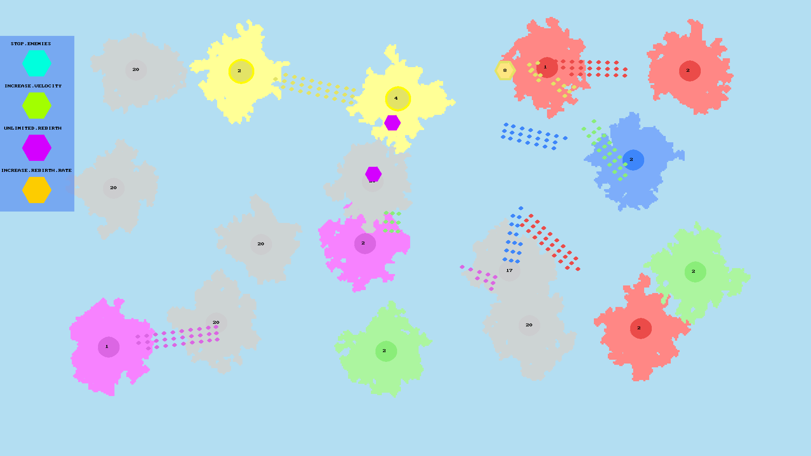

# state
A game based on [state.io](https://play.google.com/store/apps/details?id=io.state.fight&hl=fa&gl=US) create with C and SDL2.

## install requirements
### Ubuntu
- Update apt-get `sudp apt-get update` .
- Install cmake `sudo apt-get install cmake` .
- Install sdl2 libraries `sudo apt-get install libsdl2-dev libsdl2-gfx-dev libsdl2-ttf-dev` .
## build
### Ubuntu 
- Prepare to build `cmake .` .
- Build `cmake --build .` .
- Run `./state` .
- Enjoy!
